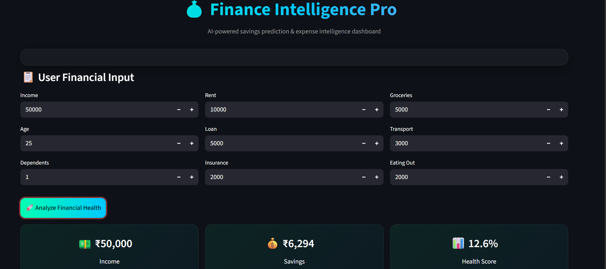
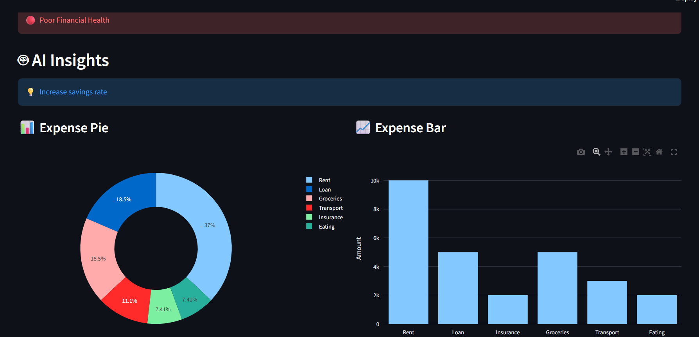

💰 Finance Intelligence Pro

   

---

🚀 Overview

Finance Intelligence Pro is an AI-powered personal finance analytics dashboard that predicts user savings, analyzes expenses, and provides smart financial insights using Machine Learning.

It helps users understand their spending behavior and improve financial decision-making through data-driven insights.

---

📸 Project Preview

---

✨ Key Features

💰 Income vs Expense Analysis

🤖 AI-based Savings Prediction

📊 Financial Health Score (0–100%)

💡 Smart Expense Optimization Suggestions

📈 Interactive Visualizations (Pie & Bar Charts)

🎨 Modern Dark-Themed Fintech UI

---

🧠 Machine Learning Model

Algorithm: Random Forest Regressor

Task: Regression (Savings Prediction)

Input Features:

Income

Age

Dependents

Rent, Loan, Insurance

Groceries, Transport, Eating Out

📊 Model Performance

Accuracy (R² Score): ~90%

Strong predictive performance on test data

---

🏗️ Tech Stack

Python 🐍

Streamlit 🎈

Pandas 📊

Scikit-learn 🤖

Plotly 📈

---

📂 Project Structure

Finance-Intelligence-Pro/
│
├── app.py                # Streamlit UI
├── train_model.py       # ML model training
├── requirements.txt     # Dependencies
├── README.md            # Project documentation
│
├── data/
│   └── data.csv         # Dataset (optional)
│
└── assets/
    └── dashboard.png    # UI screenshot

---

⚙️ How It Works

1. User enters financial details

2. Data is passed into ML model

3. Model predicts expected savings

4. Financial health score is calculated

5. Dashboard visualizes insights

---

▶️ Run Locally

# Step 1: Install dependencies
pip install -r requirements.txt

# Step 2: Train model
python train_model.py

# Step 3: Run Streamlit app
streamlit run app.py

---

📊 Example Insights Generated

Reduce unnecessary grocery spending

Control loan repayment burden

Improve savings ratio

Optimize monthly budgeting

---

🎯 Project Objective

This project is designed for:

📊 Data Analyst roles

🤖 Machine Learning internships

💼 Portfolio showcase

📈 Real-world financial analytics applications

---

📈 Business Value

This system helps users:

Understand spending patterns

Improve savings habits

Make better financial decisions

Track financial health visually

---

👨‍💻 Author

Kumar Vyshnav Pampina

---

⭐ Support

If you like this project, please ⭐ the repository

---

---
